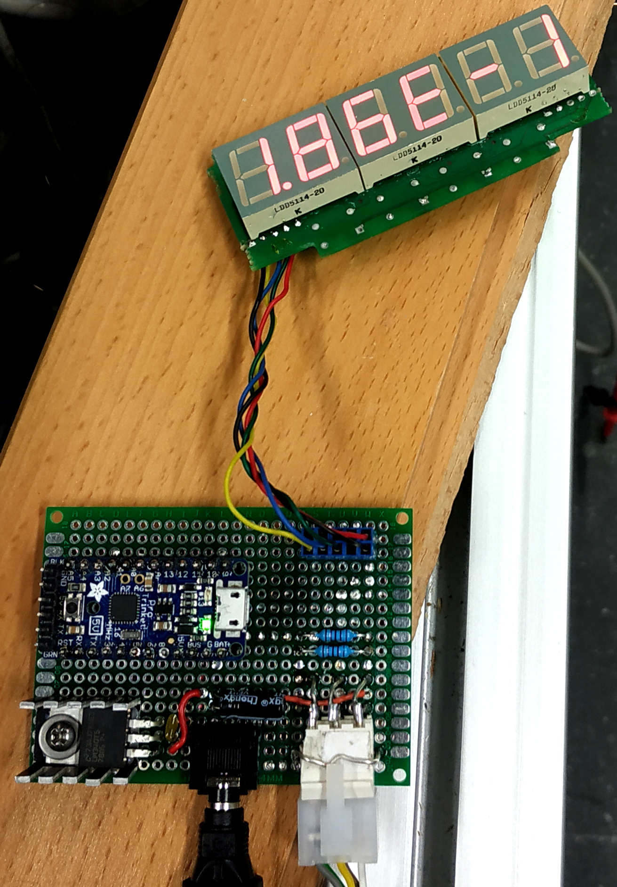

# Pressure-controller
A simple pressure controller for Pfeiffer TPR gauges (TPR 280).

  

## Principle of operation

The pressure sensor is powered with a voltage of 15 to 24V.
A linear voltage regulator is stepping down the voltage to 5V and provides the
power for the display and microcontroller.

The controller is built around an Atmel328P - based Arduino board.
The microcontroller is reading the voltage signal from the pressure gauge
through a voltage divider (converting the full range of the signal into
something that a 5V microcontroller can read).
The voltage is then converted into pressure.

Six 7-segment displays are used for displaying the pressure.
All the digits are connected to a MAX7219 LED display driver which is controlled
by the Arduino.

### Pressure calculation

The voltage signal provided by the sensor is converted to a pressure value using
the following formula:

p = 10(U - c)

where __p__ is the pressure, __U__ is the voltage reading, and __c__ is the
constant that depends on the pressure unit.
Values for the __c__ constant (for TPR 280) are shown in the following table.
| p     | c         |
|------ |-------    |
| mbar  | 5.5       |
| Torr  | 5.625     |
| Pa    | 3.5       |

